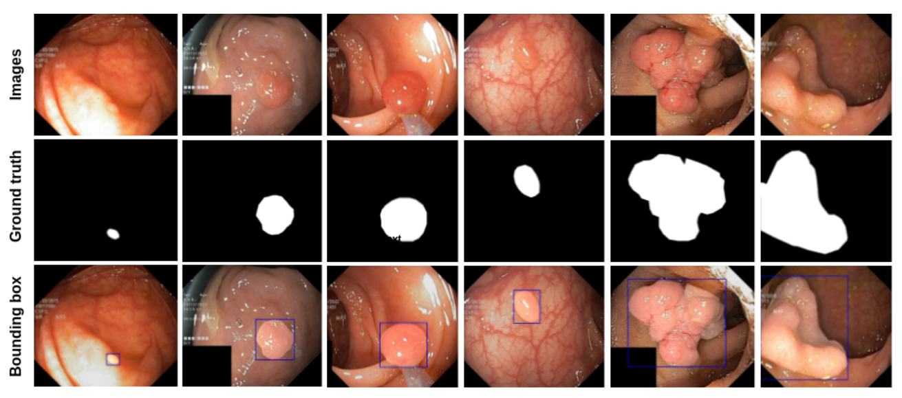

# Kvasir-SEG

Please find the paper here: [Kvasir-SEG: A Segmented Polyp Dataset](https://arxiv.org/pdf/1911.07069.pdf),

Colorectal polyp segmentation is a demanding task in medical image segmentation. Research in polyp segmentation using computer vision techniques can improve examination procedures and reduce the polyp miss rate during colonoscopy. However, finding the publicly available dataset is challenging. Even if the images are available, obtaining ground truth that shows the pixel-precise region covered by polyps is challenging. In this context, we selected the polyp class of the Kvasir dataset and annotated it with the help of a medical doctor and an expert gastroenterologist. The information about the Kvasir dataset collection procedure and dataset details can be found on this webpage. By adding ground truth and bounding box information to the Kvasir dataset's polyp class, we encourage computer vision and multimedia community researchers to develop methods that can contribute to automated polyp segmentation. 

### Dataset sample

The figure shows the example images from Kvasir-SEG. The white mask shows the area covered by the polyp region, and the background regions contain non-polyp tissue pixels. Few image samples contain the endoscope position marking probe that shows the position from where the images were captured. The images in the Kvasir-SEG were captured using ScopeGuide (Olympus). It is to be noted that in the Kvasir-SEG, we have replaced 13 images from the polyp class to enhance the dataset quality. We have put images and masks into a separate folder. The information about the bounding box is stored in JSON file format. The image name and its corresponding ground truth are the same.

Kvasir-SEG can be downloaded from here3. No prior permission is required for downloading when using the dataset for academic and research purposes. For commercial purposes, prior permission is required. We have received a few requests to use the dataset for commercial purposes and have approved them all. The dataset has also been used in a few competitions and challenges. The baseline results can be found here. Through these baseline results, we also invite other medical image analysis and multimedia research to develop and improve the current SOTA. Portions of the research community have adopted the Kvasir-SEG to benchmark their new ML algorithms and develop novel methods on the dataset.
